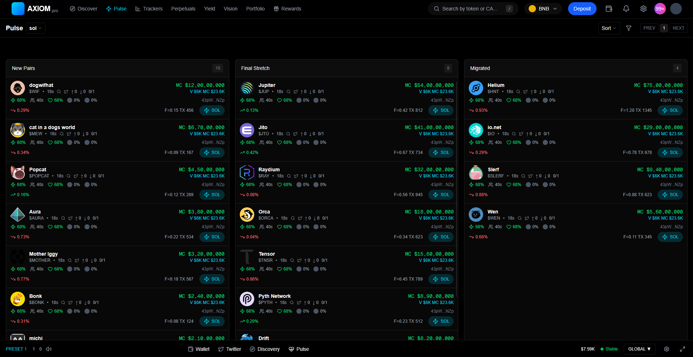
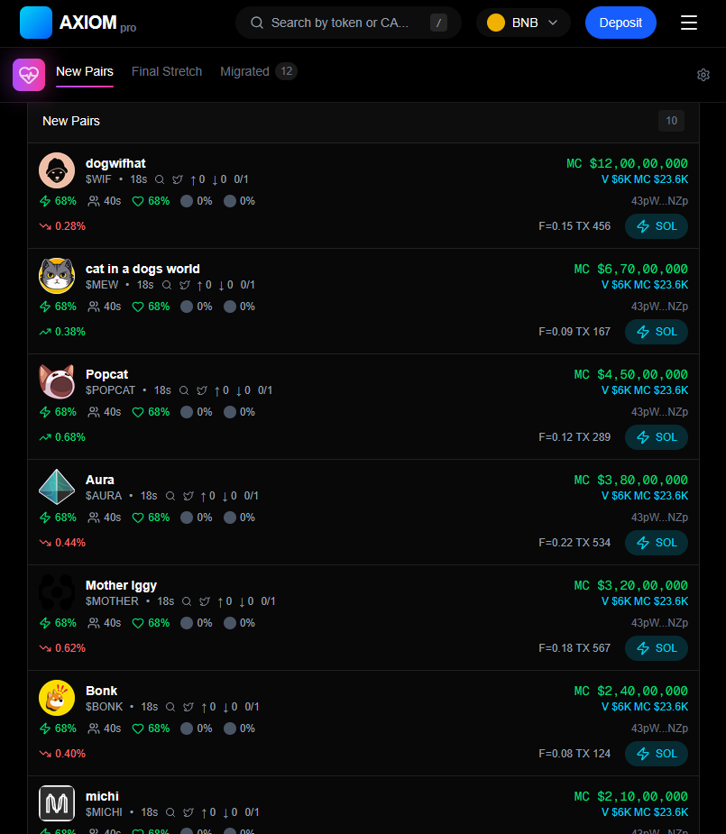

Axiom Pulse - Token Discovery UI

This project is a front end copy of the Pulse page on axiom.trade. The aim was to rebuild the token discovery tables and their behaviour, line for line, while leaving the code tidy plus ready for production.

The app uses Next.js with the App Router besides TypeScript - tailwind CSS supplies the styles. React Query pulls the token data - Redux Toolkit stores UI choices like sort order and view mode. Price ticks arrive on the client at short intervals to imitate a live market but also each tick shows a brief flash when a value changes.

Every row packs a lot of data but remains legible and follows the original grid. A click on a row opens a full detail modal. Hovering or clicking a tag opens a small pop over with extra context. Tooltips appear for secondary facts so the eye can keep moving. While data loads, skeleton rows, shimmer masks as well as progressive rendering keep the screen usable on slow links. Error boundaries stop a fault in one row from crashing the whole page.

The layout stretches or shrinks to any width, down to 320px - on small screens the table folds into a vertical stack - labels and values rearrange so nothing disappears. The interface avoids decorative motion or heavy effects so every click returns a result right away.

The site is live on Vercel.

The build prioritises speed, pixel level accuracy and long-term maintainability - no part of the UI is faked or stubbed.

# How to run!
npm install
npm run dev

Live demo: (https://axion-token-table-seven.vercel.app/)

## Responsive layout
Desktop View:

Mobile View:

Tablet View:

Lighthouse score:

